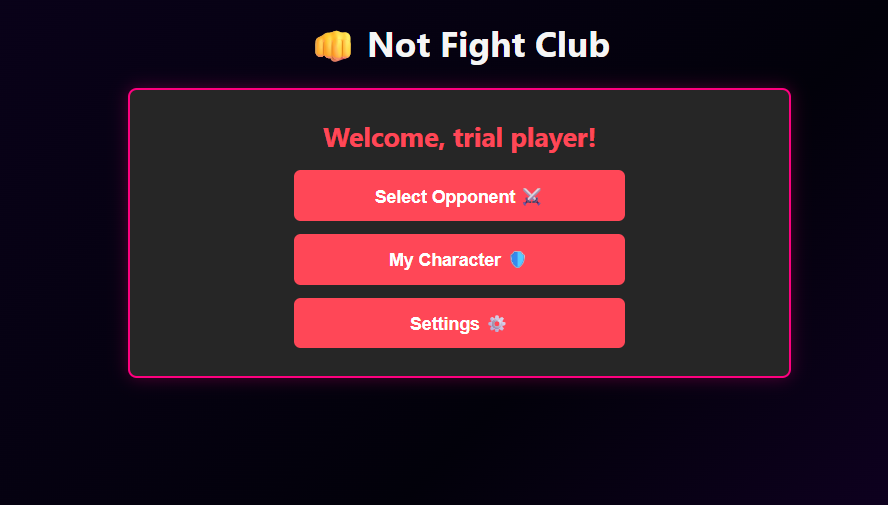
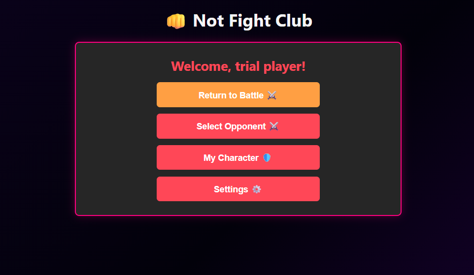
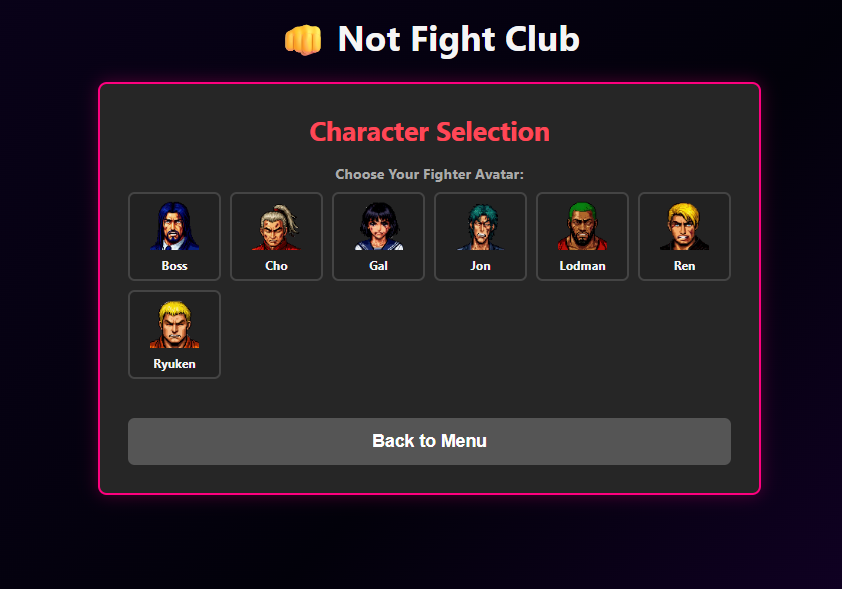
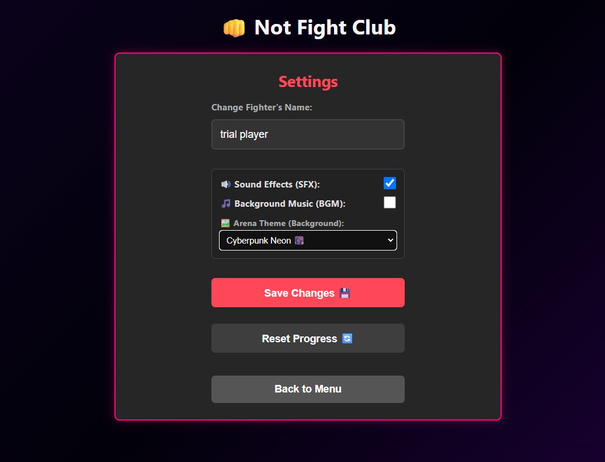
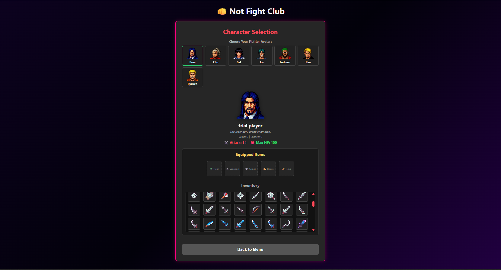
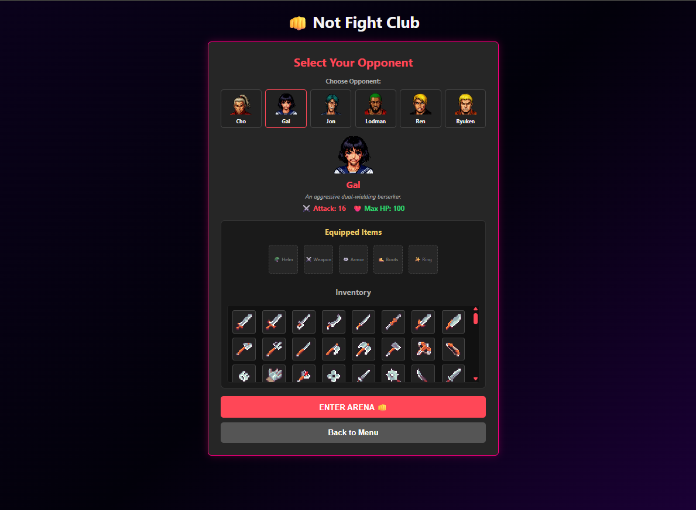
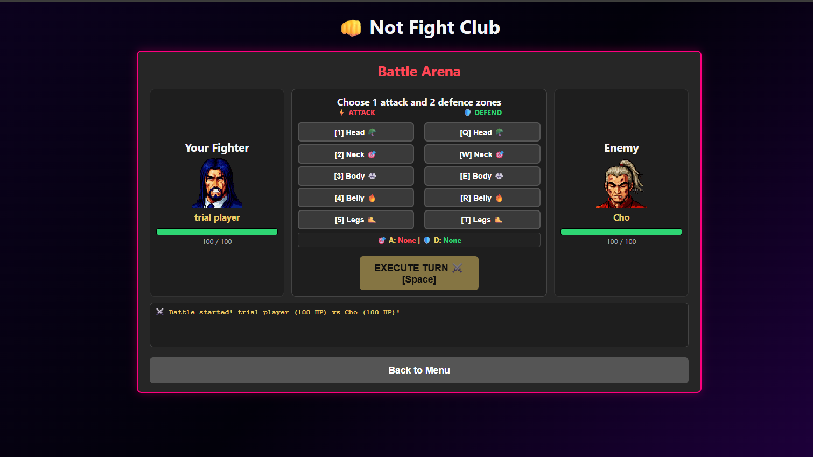

# 👊 Not Fight Club

> Interactive RPG fighting game with custom artifacts, audio engine, keyboard controls, and theme customization built with Vanilla JavaScript.

##  Quick Links
* **Live Demo / Deployment:** [https://KrychVas.github.io/not-fight-club/](https://KrychVas.github.io/not-fight-club/)
* **Task Requirements:** [Rolling Scopes School - Not Fight Club](https://github.com/rolling-scopes-school/tasks/blob/master/stage0.5%20Bootcamp/tasks/notFightClub/README.md)

---

##  Screenshots

  <b>Home Screen</b> 
  
  

  <b>Character Selection & Settings</b> 
  
  

  <b>Inventory, Stats & Opponents Setup</b> 
  
  

  <b>Battle Arena</b> 
  

---

##  Game Features & Self-Assessment (Score: 300 / 300)

### Registration Screen (20 / 20)
- [x] Player name entry with validation and persistence across reloads.

### Home Screen (10 / 10)
- [x] Quick-start button to launch new battles instantly.

### Character Page (45 / 45)
- [x] Displays character avatar, win/loss stats, and bio.
- [x] Selection grid allowing players to switch avatars anytime.

### Settings Page (20 / 20)
- [x] Name updating that reflects across all screens.
- [x] Audio toggles (SFX/BGM) and custom theme selectors.

### Battle Page & Combat Mechanics (175 / 175)
- [x] Interactive HP bars for both fighters with status indicators.
- [x] Predefined pool of diverse opponents with unique stat profiles.
- [x] Full turn-based mechanics (zones, simultaneous damage resolution, no repeated zones per turn).
- [x] Critical hits piercing through enemy defense blocks.
- [x] Detailed battle log highlighting key actions (WHO, WHOM, WHERE, HOW MUCH).

### Bonus - Full Persistence (30 / 30)
- [x] All game data, stats, inventory, and mid-battle progress saved to `localStorage`. Resume combat seamlessly after page refresh!

---

##  Extra Features & Improvements
- [x] **Inventory & Artifact System**: Integrated loot drops — winning battles rewards unique RPG artifacts with stat bonuses (HP, Damage).
- [x] **Opponent Customization**: Ability to equip items/artifacts directly onto selected enemies before starting a battle.
- [x] **Keyboard Controls**: Full hotkey support for combat actions (`1-5` for attacks, `Q-T` for defense, `Space`/`Enter` for ending turn).
- [x] **Sound Engine & Audio Settings**: Interactive sound effects (hits, criting, blocking, victory/defeat) and background music toggles in settings.
- [x] **UI Animations & Visual FX**: Screen shake on heavy hits, dynamic damage numbers, floating indicators, and custom victory visual effects.
- [x] ** Arena Themes (Backgrounds)**: Multiple visual themes (Cyberpunk, Dojo, Dungeon) with customizable background gradients and styled UI borders.

---

##  Tech Stack & Rules Compliance
* **Language:** Pure Vanilla JavaScript (ES6+ Modules)
* **Styling:** Custom CSS3 (Flexbox/Grid, CSS Variables, Animations)
* **Audio:** Web Audio API & Audio Elements
* **Frameworks Used:** **None** (100% Vanilla JS, zero third-party UI libraries)